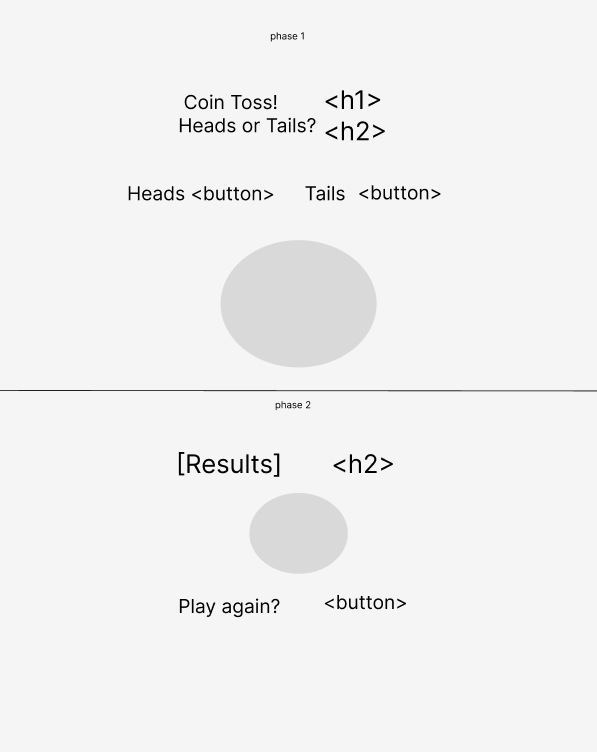

## HTML:

-   Header
-   Question
-   Heads option
-   Tails option
-   Results
-   Win or lose?
-   play again button

## States:

-   user input: heads or tails
-   random selection of array

## Events:

-   button = select heads
-   button = select tails
-   event listener triggered by buttons
-   event function: selects random result
-   output win or lose if matches result
