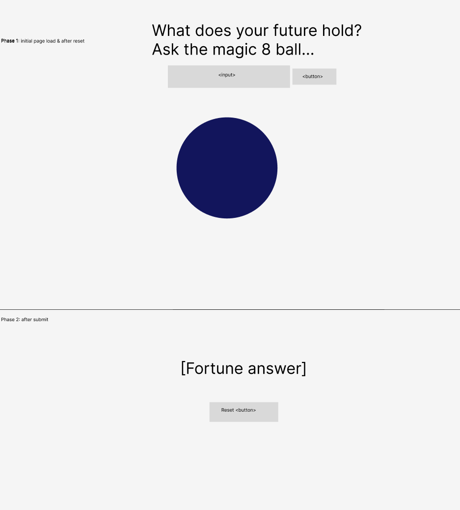

## HTML

-   Input. why: user interaction. How: input
-   Submit Button. why: triggers event listener. how: button
-   Image (8ball). why: fun display. how  wrapped in div
-   Fortune display
-   Reset button

## State

-   Randomly selected fortune

## Events

-   Initial submission button click:
    -   Picks random fortune
    -   Removes 8ball img & input
    -   displays fortune
    -   displays try again
-   Play again button click:
    *displays the 8ball inputs
    *removes fortune div
